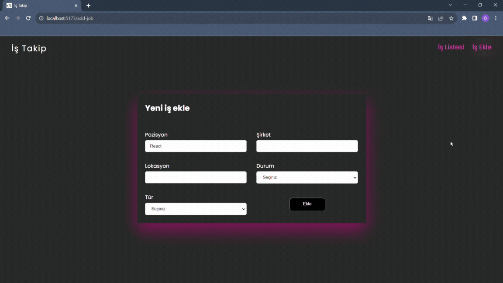

## Proje Yapısı:

- Komponentler ve sayfalar organize edildi.

- Redux toolkit kullanarak proje yapısı oluşturuldu.

- JSON Server ile veriler tutuldu.

- - Ana Sayfa:

- İşleri listeler ve filtreleme yapılabilir.

- - İş Ekleme Sayfası:

- Kullanıcı yeni işler ekleyebilir.

- - Redux Toolkit Kullanımı:

- redux toolkit kuruldu ve yapılandırıldı.

- redux toolkit ile iş yönetimi (slices,actions,reducers) gerçekleştirildi.

## Kullanılan Kütüphaneler

- react-router-dom
- axios
- sass
- react-toastify
- json-server
- react-redux
- @reduxjs/toolkit
- uuid

## Gif

